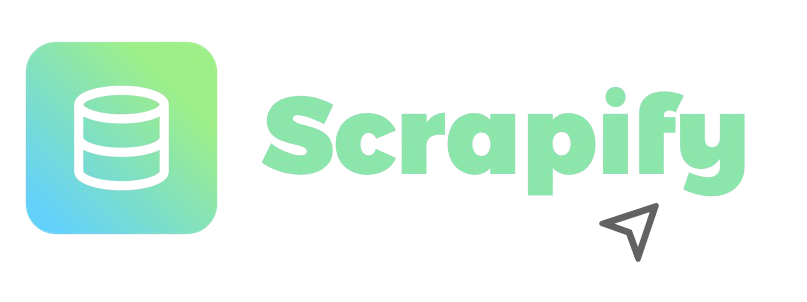

# Scrapify: Effortless Web Scraping, Seamless Deployment



> Scrapify is a full-stack web application designed to not only scrape data from user-provided URLs but also analyze and categorize this data using AI models. The platform simulates browser-like interactions, supports automated deployment, and integrates real-time monitoring, making it an ideal solution for AI agents interacting with the web at scale.

## Features ✨

- **AI-Enhanced Data Scraping**: Scrapes data and uses AI models to analyze and categorize it on the fly (upcoming soon!)
- **Browser Simulation**: Simulates user interactions within a headless browser, enabling complex web scraping scenarios.
- **Automated Deployment**: Integrated CI/CD pipeline for streamlined deployment and updates.
- **Real-Time Monitoring**: Real-time performance tracking with logging and monitoring tools.

## Tech Stack 🛠️

- **Frontend**: HTML, CSS, JavaScript
- **Backend**: Node.js, Express.js
- **Database**: MongoDB
- **AI Model**: TensorFlow.js or pre-trained NLP models (upcoming soon!)
- **Automation**: CI/CD with GitHub Actions or Jenkins
- **Deployment**: Vercel

## Get Started ⚙️

1. Clone the repository:
   ```bash
   git clone https://github.com/Xcelerity/Scrapify.git
   cd scrapify
   ```

2. Install the dependencies:
    
    ```bash
    npm install
    ```

3. Set up environment variables:

    3.1 Create a `.env` file in the root directory.

    3.2 Add your MongoDB URI, API keys, and other necessary environment variables.

4. Access the application at `http://localhost:3000`.

## Usage 🌐

1. Input the URL you want to scrape in the provided form.

2. Choose any additional options, such as enabling AI categorization.

3. Submit the form to begin the scraping process.

4. View the scraped data and any AI-generated insights directly on the results page.

## Challenges and Solutions ⚡️

- Data Privacy: Ensured compliance with data privacy regulations, particularly GDPR, by implementing strict data handling practices.

- Performance at Scale: Optimized the backend to handle large volumes of data efficiently, with AI analysis running in real-time.

- Browser Simulation Accuracy: Fine-tuned headless browser settings to replicate genuine user interactions accurately.

## Future Iterations 🚀

- Enhanced AI Models: Integrate more advanced AI models for deeper data analysis.

- Multi-Browser Support: Expand the platform to support additional browser engines.

- Real-Time Feedback Integration: Implement user feedback to refine AI models over time.

- Cloud Infrastructure: Transition to a scalable cloud-native architecture to support a growing user base.

## Contributing 🤝

We welcome contributions! Please read our LICENSE for details on how to get started.